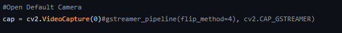

## Встроенные системы, лаба №3

### Примеры кода:

+ [Егор](https://github.com/3ilib0ba/ITMO-Embedded-Systems/tree/main/lab-3)

### Про подготовку, материал:

+ Делал не я, а в основном Егор, но ничего сложного в лабе нет для второго варианта точно. Не думаю, что первый 
делается сильно сложнее. Берёте за основу файлы, которые вам дадут, на них уже накатываете свой вариант(color.py ...)

+ На защите надо будет запустить мастер-класс на микрокомпутере, где доступ к камере может осуществляться по-другому,
для этого надо раскомментить строку как на фото:

+ По защите лишь понимание устройства цветов, цветовых схем.

[//]: # (к оглавлению и на прочие лабы)

    <a style="text-align: right" href="lab-2.html">Мастер-класс №2</a>

    <a href="../../secondcourse.html">На главную</a>

    <a style="text-align: right" href="lab-4.html">Мастер-класс №4</a>

