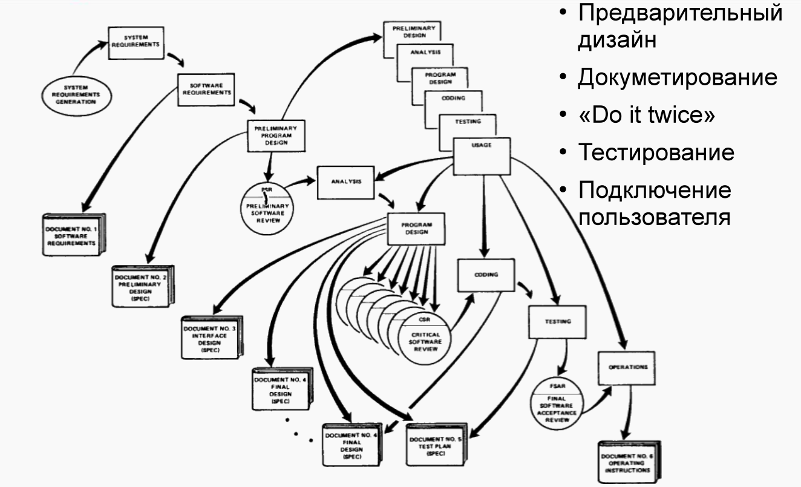

## Методы и средства ПИ, лаба №1

[//]: # (### Примеры кода:)
[//]: # (+ [Жека]&#40;https://github.com/3ilib0ba/ITMO-Embedded-Systems/tree/main/lab-1&#41;)
[//]: # (+ [Боря]&#40;&#41; <- добавить ссылку)

### Примеры SRS документа: 

[Полное руководство](https://krazytech.com/projects/sample-software-requirements-specificationsrs-report-airline-database)

[Статья с Хабра](https://habr.com/ru/post/52681/)

[Пример реального SRS, обрезанного примерно на 50%](https://ddintsis.files.wordpress.com/2013/08/srs_v_4_0_1.doc)

> От автора: советую изучить и внимательно прочитать хотя бы один 
> настоящий SRS документ и сделать всё не хуже, всё должно быть понятно 
> и не должно вызывать вопросов. Как пример: есть у вас какой то относительно
> известный термин "speed test" -- проверка скорости интернета, тогда такой
> термин следует занести в СОГЛАШЕНИЕ О ТЕРМИНАХ(используемых в документе)
> и описать его полно.

### Вопросы по лабораторной работе с se.ifmo.ru:
1) **Методологии разработки ПО. Унифицированный процесс.**

-- --

Вообще их существует очень много, но мы рассмотрим лишь некоторые, также есть статья по некоторым
из таких методов разработки ПО [с хабра](https://habr.com/ru/company/edison/blog/269789/)

-- --

- Каскадная, "водопад" модель.

В такой модели есть понятие итерации, можно вернуться к предыдущему шагу и проделать часть заново, 
но большие возвраты сопровождаются большими рисками и потерями(лишь на стадии тестирования можно проверить разные
характеристики продукта, производительность и прочее, и, если они окажутся не теми, что планировались, то возможна
почти полная переделка приложения). Вот стандартные шаги данной модели:

- 1) Определяются системные требования.

- 2) Определяются требования к ПО.

- 3) Требования анализируются. 

- 4) Проектируется программа.

- 5) Разрабатывается код.

- 6) Проводится тестирование.

- 7) ПО вводится в эксплуатацию.

-- -- 

- Методология Ройса.

Первый шаг в данной системе это реализация "дизайна программы". Предлагается определить и создать 
модели обработки данных, разработать документ программы, даже если потом это будет подтвергаться переделкам.

Далее второй шаг — документирование дизайна. Ройс перечисляет важнейшие документы для
процесса разработки ПО. Это требования к системе, спецификация предварительного
дизайна, спецификация дизайна интерфейсов, финальные спецификации дизайна системы,
план тестирования, инструкция по использованию.

Третий шаг — "do it twice". В нём Ройс предлагает провести симуляцию — тестовую
разработку (параллельно основному процессу), и использовать её в качестве пилота с
сокращённым временем разработки. Это позволит подтвердить или опровергнуть основные
характеристики ПО.

Четвертый шаг — планирование, контроль и мониторинг тестирования. Ройс показывает,
что тестирование является наиболее рискованной фазой с точки зрения денег и сроков, и
является последней точкой, где может быть выбрана альтернатива. При планировании
тестирования Ройс предлагает исключить дизайнера системы из процесса тестирования,
провести "визуальную инспекцию" — повторный просмотр кода другим лицом, которое, не
проводя глубокий анализ, отметит визуально заметные дефекты, протестировать каждый
логический путь внутри программы (несмотря на то, что это труднореализуемо). После
исправления большинства простых ошибок провести проверку (checkout) программы в
необходимом тестовом окружении.

Шаг пятый — подключение пользователя. Ройс предлагает подключить пользователя на ранних
этапах перед финальной поставкой продукта. В своей модели он представил три точки, где
необходим опыт, оценка и подтверждение пользователем — предварительный, критический и
финальный просмотр.

-- --

- V-образный метод разработки ПО(традиционный).

Аналогичный способ разработки как в каскадной системе, но для каждого шага *разработки* есть 
свой шаг *тестирования*. Так после каждого шага можно проверить его соответствие с ожиданиями. 
"Ожидаемый" результат(он же эталонный) всегда задан **вне кода** и с ним должно происходить сравнение
работы программы.

Динамическое тестирование (правая половина V) включает компьютерное исполнение
тестов, а статическое тестирование предполагает проверку артефактов разработки без их
компьютерного исполнения, например спецификации, технических решений, дизайна, и пр.

Статические тесты могут выполняться на ранней стадии проекта, что позволяет выявлять
грубые ошибки в проектировании и избегать создания нефункционального или
неработоспособного продукта.

-- --

- Многопроходная модель.

Учитывая сложность изготовления продукта в один этап, было предложено разбить
продукт по отдельным функциональным и техническим требованиям, а впоследствии
проектировать, реализовывать и интегрировать воедино в несколько проходов разработки в
виде отдельных сборок, которые стали называть инкрементами функционала или просто
инкрементами.

Инкрементальный подход позволяет существенно снизить стоимость изменений
требований заказчика. Разработка становится более управляемой, прогресс разработки
становится видимым для заказчика, заказчик может комментировать и исправлять проектную
документацию и управлять желаемой функциональностью. Более того, заказчик может
использовать в своей работе частично разработанную систему. Современные гибкие (agile)
методологии опираются именно на такой итеративный подход.

У инкрементного подхода есть и недостатки. Основной из них заключается в том, что
архитектура системы имеет тенденцию к устареванию и деградации, и с течением времени
начинает требовать рефакторинга, т.е. полной или частичной переработки, что сложно
заказчику, и соответственно выполнить за счет его финансирования. Большие системы,
разработка и поддержка которых осуществляются параллельно разными командами
разработчиков, нуждаются в стабильной, неизменяемой архитектуре и АР!, которые
необходимо спланировать заранее, перед разработкой основного функционала.
Инкрементный подход сложен и с точки зрения управления проектом, документы по
программным сборкам сложно поддерживать из-за большой скорости изменений.

Отдельной сложностью является и заключение контрактов на разработку. Традиционные
подходы к бюджетированию предпочтительными полагают фиксированные суммы на
разработку этапов, где сложно учесть потенциальное появление изменений, и включить
почасовую оплату отработанных часов.

-- --

2) **Требования и их категоризация. Атрибуты требований.**

-- --

-- --

3) **Язык UML.**

4) **Прецеденты использования. UseCase-диаграммы - состав, виды связей.**

[//]: # (к оглавлению и на прочие лабы)

    

    <a href="../secondcourse.html">На главную</a>

    <a style="text-align: right" href="lab-2.html">Лабораторная №2</a>

