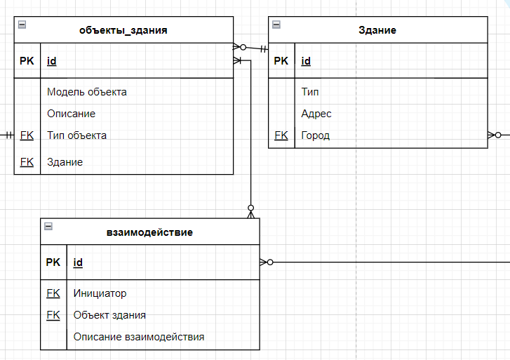

## Информационные системы и базы данных, лаба №1

### Примеры кода, отчётов:
+ [Жека](https://github.com/3ilib0ba/ITMO-DB/tree/master/Labs/Lab-1)

[comment]: <> (+ [Кирилл]&#40;&#41;)

### Про подготовку, материал:

Лабораторная работа с созданием простой модели предметной области. Читаем 
лекции, думаем головой. 

### Вопросы:

1) Вывести список зданий по убыванию в количестве их взаимодействий

[//]: # (к оглавлению и на прочие лабы)

    

    <a href="../../thirdcourse.html">На главную</a>

    <a href="lab-2.html">Лаба №2</a>

