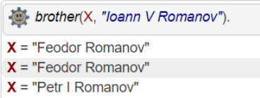

## Системы искусственного интеллекта, лаба №1

### Примеры кода:
+ [Жека](https://github.com/3ilib0ba/ITMO-Systems-of-AI/tree/main/Lab-1)

[//]: # (+ [Боря]&#40;https://github.com/rosroble/ITMO-embsys&#41;)

### Про подготовку, материал:

Не особо сложная лаба, надо разобраться с ProLog'ом. Для этого можно изучить:

1) [Методичка](https://books.ifmo.ru/file/pdf/658.pdf) <-максимальное одобрение автором

2) [Введение с Хабра](https://habr.com/ru/post/124636/) 

3) [Запускаем и тренируемся на сайте](https://swish.swi-prolog.org/)

### Вопросы: 

1) Создайте команду uncle(A, B). Создаём
>    *uncle(A, B) :- parent(C,B), brother(A, C).*

2) При работе правила поиска братьев Ивана Пятого "Феодор Романов" выдаётся дважды, 
а "Пётр Первый" всего лишь один раз. Почему так?

> Дело в том, что команда поиска братьев ищет их по общим родителям. Так как 
Феодор является кровным братом, то он подходит в выражение и ПО МАТЕРИ, и по ПАПОЧКЕ, 
поэтому мы видим его дважды. А Пётр 1 является братом от другой жены отца и потому
подходит лишь по отцовской линии, поэтому он есть лишь 1 раз в результате.

[//]: # (к оглавлению и на прочие лабы)

    

    <a href="../../thirdcourse.html">На главную</a>

